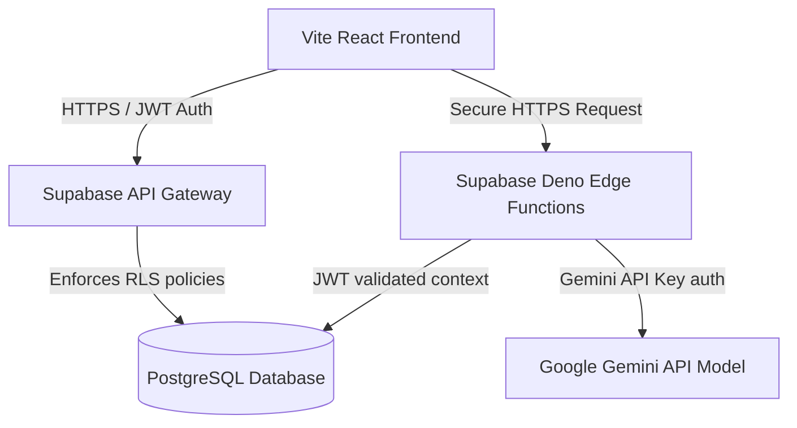

# System Architecture — BrewFlow AI

This document details the system design, multitenancy separation, and data flow of BrewFlow AI.

---

## 1. System Topology

BrewFlow AI is built as a single-page application (SPA) backed by serverless cloud database services:



---

## 2. Multitenancy & Workspace Isolation

BrewFlow AI uses **shared database multitenancy** with Row-Level Security (RLS). 

- **Tenant Identifier:** Every table (except `organizations`) contains an `organization_id` column.
- **Access Control:** All Select, Insert, Update, and Delete operations on the database automatically append organization filter checks at the SQL engine level.
- **Authentication context:** Supabase parses the active user's JWT metadata to extract their active workspace context:
  `auth.jwt() ->> 'org_id'`

---

## 3. AI Service Abstraction Layer

The system uses a provider-independent AI layer to enable easy swapping of underlying models:

```
[UI Components] 
      ↓
[aiService.js (Provider Abstraction)] 
  - generateColdEmail()
  - generateWhatsApp()
  - generateCallScript()
  - scoutProspects()
      ↓
[Supabase Edge Functions] 
  - Token/secret handling
      ↓
[AI Provider Model (Gemini / Claude / OpenAI)]
```

Adding a new provider (e.g. OpenAI or Claude) only requires changing the Edge Function implementation. The React UI components remain completely unchanged because they query the abstracted `AIService` methods.
