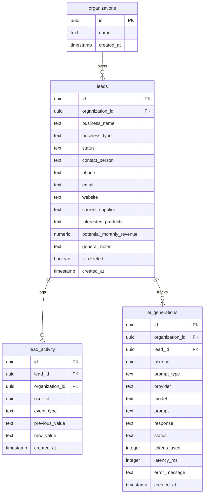

# Database Schema & Security Policies — BrewFlow AI

This document maps the Postgres database structure, tables, columns, foreign keys, and RLS policies of BrewFlow AI.

---

## 1. Entity Relationship Model



---

## 2. Row-Level Security (RLS) Definitions

All tables have RLS enabled. No query can bypass RLS constraints.

### Leads Isolation Policy
```sql
ALTER TABLE leads ENABLE ROW LEVEL SECURITY;

CREATE POLICY "Allow workspace reads"
ON leads FOR SELECT
USING (organization_id = (auth.jwt()->>'org_id')::uuid);

CREATE POLICY "Allow workspace inserts"
ON leads FOR INSERT
WITH CHECK (organization_id = (auth.jwt()->>'org_id')::uuid);

CREATE POLICY "Allow workspace updates"
ON leads FOR UPDATE
USING (organization_id = (auth.jwt()->>'org_id')::uuid);

CREATE POLICY "Allow workspace soft-delete"
ON leads FOR DELETE
USING (organization_id = (auth.jwt()->>'org_id')::uuid);
```

### AI Generations History Policy
```sql
ALTER TABLE ai_generations ENABLE ROW LEVEL SECURITY;

CREATE POLICY "Allow generation history read"
ON ai_generations FOR SELECT
USING (organization_id = (auth.jwt()->>'org_id')::uuid);

CREATE POLICY "Allow generation logs insert"
ON ai_generations FOR INSERT
WITH CHECK (organization_id = (auth.jwt()->>'org_id')::uuid);
```
